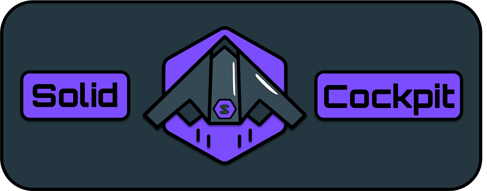

---

## Table of Contents
- [Ways to Get a Solid Pod](#ways-to-get-a-solid-pod)
- [Contribute](#contribute)
- [Development Notes](#development-notes)
- [TRIPLE Guide](#triple-guide)
- [Solid Pod VoID File Generation Guide](#solid-pod-void-file-generation-guide)
- [Contact](#contact)

# Solid Cockpit

This repository contains all code and guides for the Solid Cockpit web application. Solid Cockpit is an intuitive web application for accessing, editing, and interacting with Solid Pods. 

This applicaiton was originally made for the CHIST-ERA TRIPLE project. For additional getting started guides and information about this project please see ... .

**To use this App, you need to already have a Solid Pod!**


## Ways to Get a Solid Pod:

- [Community Solid Server](https://communitysolidserver.github.io/CommunitySolidServer/latest/): For hosting a Solid Pod on your local machine or on a custom server.
- [Solidcommunity.net](https://solidcommunity.net/): A community-run Solid server (very easy).
- [Other Solid Pod Hosting Services](https://solidproject.org/for-developers#hosted-pod-services): A catologue of other services that offer Solid Pod hosting.


## Contribute

Code contributions are welcome! Please commit any pull requests against the `main` branch.

Issue reporting and other general feedback are welcome. Please use GitHub Issues open an issue or GitHub Discussions where applicable.


## Development Notes:

#### General issues:

- If weird things start to happen with athn issues, clear browser history and cookies and it should fix things.

---


## TRIPLE Guide
👋 Welcome to the TRIPLE Getting Started Guide! This document will help you set up a Solid Pod and introduce you to the features of the Solid Cockpit app. Follow the steps carefully to get up and running 🚀


### 🎯 Objectives of This Guide

1. Setting up a Solid Pod (that is accessible via the internet)
2. Logging into your Pod at any time (after setting it up)
3. Understanding the features and functionalities of the Solid Cockpit app.
4. Overview of future capabilities, such as managing pod contents, adjusting data privacy, and querying data using SPARQL.


### 🌐 Setting Up a Solid Pod (Online)

To **set up** your Solid Pod using the TRIPLE platform, follow these steps:

1. **🔗 Navigate to our Solid Pod Hosting website**
   - Go to [https://triple.ilabt.imec.be/](https://triple.ilabt.imec.be/)
   - Use the following credentials to enter the site:
     - **Password**: `triple`
   
2. **🔐 Sign Up to make a Pod**
   - Click **Sign Up** (assuming this is your first time)
   
3. **🛠️ Create Your Solid Pod**
   - Once you are on the **Your Account** page, click on **Create Pod**.
   - Enter a name for your new pod and click **Create Pod**.
   - After creating your pod, return to the home page by clicking **Back**.

### 🔑 Logging into your Solid Pod (after creation)
1. **Navigate to our Solid Pod Hosting website**
   - Go to [https://triple.ilabt.imec.be/](https://triple.ilabt.imec.be/)
   - Use the following credentials to enter the site:
     - **Password**: `triple`

2. **Login using your credentials**
   - Click **Login** (assuming you have already made an account)

3. **Register your Pod on your new WebID card**
   - Navigate to the "Home" page of the [Solid-Cockpit Webpage](https://knowledgeonwebscale.github.io/solid-cockpit/home)
   - Login to your Solid Pod using the "https://triple.ilabt.imec.be/" provider
   - CLICK the "REGISTER POD" button (not necessary to enter any PodURL)
   - Thats it. Now you are connected to your new Pod!!

### 🛫 Using the Solid Cockpit App

The Solid Cockpit app provides several functionalities for managing and interacting with your Solid Pod.

#### ✨ Available Features

1. 📝 **Data Upload**
   - Upload data to your Pod.
   - When uploading RDF data, file validity can be assessed before uploading.
   - Specify and modify the metadata of uploaded files.

2. 🗂️ **Data Browser** (under construction)
   - View, modify, move, and delete the contents of your Pod.
   - Explore and edit the container structure of your Pod.

3. 🔍 **Data Query**
   - An editor to write SPARQL queries to interact with data in your Pod, the Pods of others, and SPARQL Endpoints.
   - A user input to designate the sources for the queries.
   - Options that impact the the output formats, query execution, and other relevant parameters.
   
4. 🔒 **Data Privacy Management**
   - View the current privacy settings for your data (Read, Write, and Append).
   - Add or change privacy settings to containers and resources in your Pod.
   - Give and receive notifications related to new access rights to the data of others.


### 🔮 In the Near Future

- Improve the functionality of the Pod Browser for displaying pod contents effectively.
- Ability to query using the SIB SPARQL Editor (with auto-complete + class visualization + example queries)
- Enhance privacy management display ++ include sharedWithMe.ttl // sharedWithOthers.ttl

> Stay tuned for future updates that will bring more features and improvements to the Solid Cockpit app, making it more powerful and easier to use.


### 🤝 Support and Further Information

If you encounter issues during setup or usage, please consult our support resources or reach out to our support team for assistance.

---


## Solid Pod VoID File Generation Guide

### Tool Download

Please navigate to https://github.com/JervenBolleman/void-generator/tree/solid-pod-support for more information about local dependencies and run guides.

### Local command to execute

```
mvn package

java -jar target/void-generator-0.7-SNAPSHOT-uber.jar --from-solid-pod [URL-to-solid-pod] --void-file void.ttl -i [URL-to-solid-pod]/void.ttl --repository [URL-to-solid-pod]
```

### After VoID File Generation

- Upload the VoID file to your Solid Pod (to the root directory [i.e. www.yourwebid.com/pod]) via the `Data Upload` page of Solid Cockpit


---

## Contact

🙏 We hope you find this guide helpful in setting up and exploring your Solid Pod. For questions or comments: [go here](https://github.com/KNowledgeOnWebScale/solid-cockpit/discussions). To report bugs or problems: [try here](https://github.com/KNowledgeOnWebScale/solid-cockpit/issues).


We hope you enjoy piloting your Solid Pod with Solid Cockpit!
